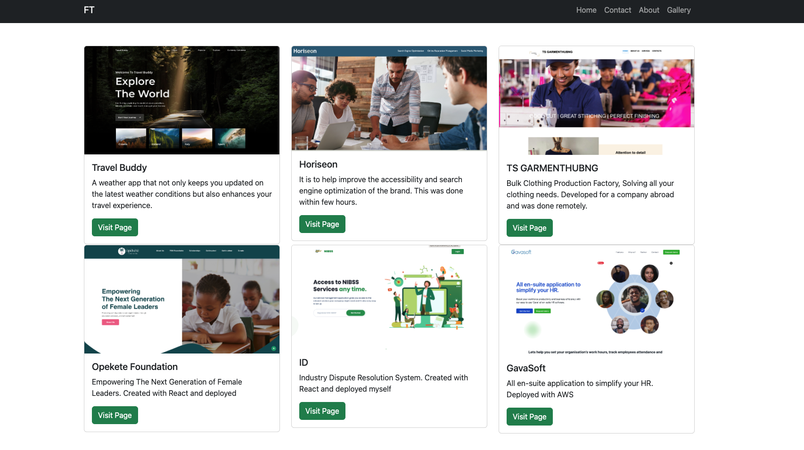

# FALADE PORTFOLIO

Welcome to my React portfolio! This portfolio was created to showcase my skills and projects, making it easier for potential employers to learn more about me and my work.

## Description

In this project, I used React to develop the initial scaffolding for my portfolio site. It's designed to provide a polished and professional look, following the principles of mobile-first design. The portfolio aims to set me apart from other developers by using React and other modern technologies.

## Summary

- [Description](#description)
- [User Story](#user-story)
- [Acceptance Criteria](#acceptance-criteria)
- [Mock-Up](#mock-up)
- [Technologies Used](#technologies-used)
- [Usage](#usage)
- [Deployment](#deployment)

### User Story

```
Creating a portfolio from my github
```

### Acceptance Criteria

- Create a portfolio based on bootstrap
- Use media queries to create a portfolio across different screens

### Mock-Up

The following image shows the web application's appearance and functionality:



### Technologies Used

- HTML
- CSS
- Bootstrap
- React
- React Router (for navigation)

### Usage

You can clone this repository using `git clone https://github.com/faladetimilehin/react-portfolio` or ssh `git clone git@github.com:faladetimilehin/react-portfolio.git`

### Deployment

https://faladetimilehin.github.io/react-portfolio/

> **Note**: This layout is designed for desktop viewing, so you may notice that some of the elements don't look like the mock-up at a resolution smaller than 768px.
